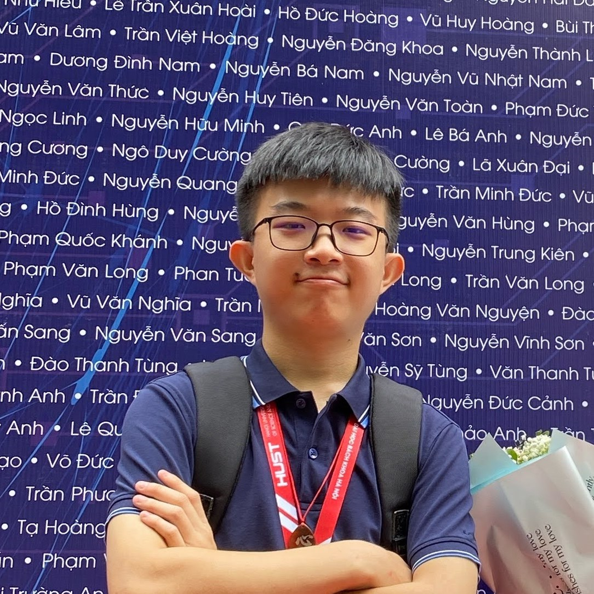

### 👋 Hi pī̀ noong, I’m [@maduc238](https://github.com/maduc238)

### About me ...

- :office: Work at **Viettel Cyber Security**
- :school: Was a student at **School of Electronics and Electrical Engineering - Hanoi University of Science and Technology** - :pencil: **Academic Year 2019-2023 | Talented Program in Electronics and Telecommunications**
- :e-mail: Email **mavietduc@gmail.com**
- :speech_balloon: Facebook **[Ma Đức](https://www.facebook.com/maduc238)**

<!---
maduc238/maduc238 is a ✨ special ✨ repository because its `README.md` (this file) appears on your GitHub profile.
You can click the Preview link to take a look at your changes.
--->
